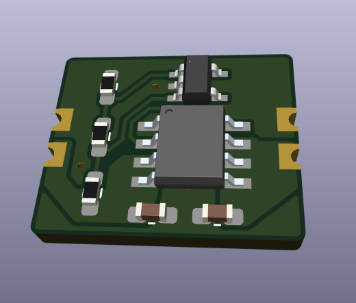
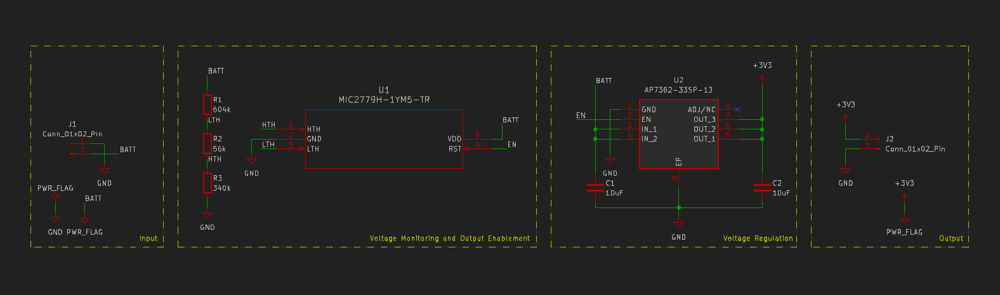

# Battery Regulator Module

Custom lithium-polymer battery voltage monitor and regulator module.

## Overview

This custom module is designed as a drop-in module for small-scale electronics providing 3.3V linear regulated voltage output from a raw lithium polymer cell input. The battery input voltage is monitored by the [MIC2779](https://www.digikey.com/en/products/detail/microchip-technology/MIC2779L-2YM5-TR/1616864) whose output enables or disables the regulated output supply. It is configured to cutoff output at 3.1V input and hold in reset until the input voltage exceeds 3.6V.

The module supports the 1.5A maximum current limitations of the regulator chip [AP7362](https://www.digikey.com/en/products/detail/diodes-incorporated/AP7362-33SP-13/5305857) used.

This module may be combined with a Lipo charger module such as the [TP4056](https://www.best-microcontroller-projects.com/tp4056.html) (along with any in-circuit charging mods as required) for a complete custom battery charging/monitoring/regulation for small-scale electronics projects.

## Schematic

## License

MIT © 2024 John Greenwell